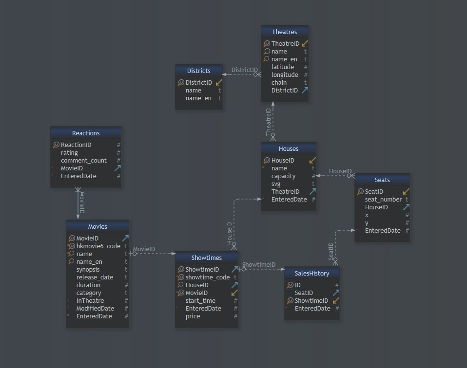

<!-- PROJECT LOGO -->
 

  <a href="https://github.com/github_username/repo_name">

[comment]: <> (    )
  </a>

<h2 align="center">🍿 Hong Kong Cinemas Data Study </h1>

  

	This is an ongoing project that aims to produce meaningful analysis and visualizations of Hong Kong cinemas,
	using data of over 400 movies and 123,000 shows collected by three scrapers.
     
  

 

This project consists of three parts:
1. [Data Collecting and Modeling](https://github.com/tophersss/HongKong-CinemasScrapers)
2. [Data Visualization](https://github.com/tophersss/HongKong-CinemasDashboard)
3. Data Analysis

<!-- DATA COLLECTING AND MODELING -->
## 📚 Data Collecting and Modeling

All data used in this project were scraped between from [hkmovie6](https://hkmovie6.com/), a website that displays real-time showtimes and seatplan data, between October 2021 and June 2022.

Three scrapers were built to extract 🎞️movie data, 🎫showtime data, and 💺seat occupancy data respectively.

Each scraper has its own pipeline to process and transform the data before writing to a SQLite database. Up to 13 June 2022, they have scraped data of 445 movies and 122,897 shows.

Learn more about the technical process at this GitHub repo: [HongKong-CinemasScraper](https://github.com/tophersss/HongKong-CinemasScrapers)

 

*keywords: Python, web-scraping, data modeling, relational database management, multi-threading*

<!-- DATA VISUALIZATION -->
## 📊 Data Visualization

An interactive dashboard made with real-world data to visualize cinemas' popular times, sales, and seat popularity.

Learn more about the technical process at this GitHub repo: [https://github.com/tophersss/HongKong-CinemasDashboard](https://github.com/tophersss/HongKong-CinemasDashboard)

Demo: [https://hongkong-cinemasdashboard.netlify.app/about](https://hongkong-cinemasdashboard.netlify.app/about)

 

*keywords: SQL, charts, dashboard, Javascript, React, HTML, CSS*

<!-- DATA ANALYSIS -->
## 📝 Data Analysis

Coming soon!

<!-- CONTACT -->
## ☎️ Contact

Chris Suen - chrissssuen@gmail.com

[//]: # (- [LinkedIn]&#40;https://twitter.com/twitter_handle&#41;)
